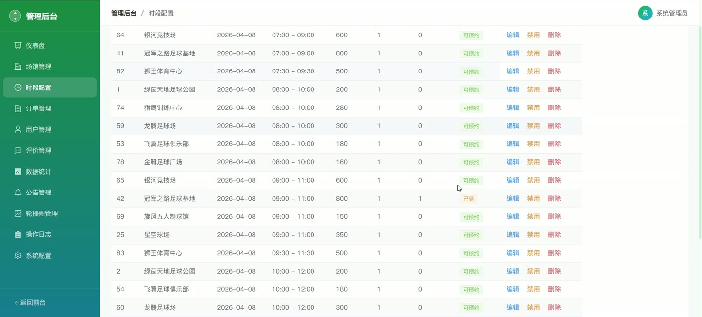
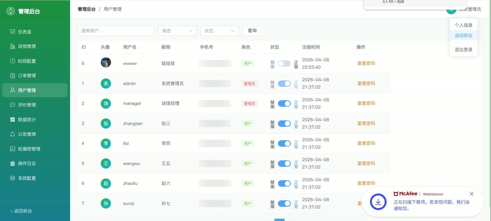
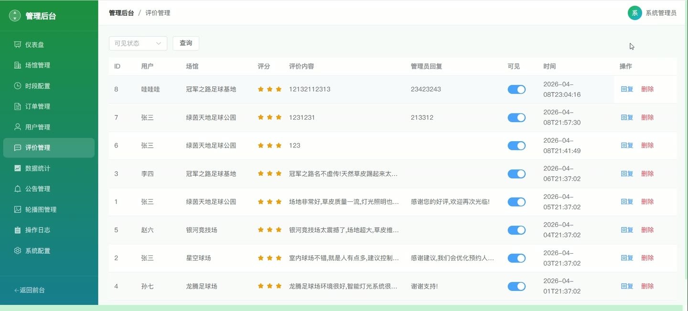

# (附文档)Springboot3+Vue3+MySQL 足球场馆智能预约系统

**技术栈**：Springboot3、Vue3、MySQL

### 系统简介

本系统是一套基于 Spring Boot 3 + Vue 3 + MySQL 的足球场馆智能预约系统，采用前后端分离架构。系统包含普通用户端和管理员端两个角色，实现了场馆浏览与搜索、时段预约、订单管理、在线支付模拟、评价反馈、个人中心以及后台数据统计、用户管理、场馆管理、订单审核、系统配置等完整功能。
 
### 核心功能
 
### 普通用户端

 
- 注册账号：填写用户名、密码、昵称、手机号完成注册，系统自动校验用户名唯一性及密码长度。 
- 登录系统：输入用户名和密码登录，成功后返回 JWT Token 并记录登录日志。 
- 查看场馆列表：按名称/地址关键词搜索、按场馆类型筛选、按价格区间过滤、按评分或价格排序。 
- 查看场馆详情：展示场馆基本信息、多张轮播图片、设施介绍、评分与评价列表。 
- 查看时段列表：选择场馆和日期，查看该日所有可预约时段（含开始/结束时间、价格、剩余名额）。 
- 创建预约订单：选择一个时段提交预约，系统自动校验每日预约次数上限（可配置）、提前预约天数限制、时段冲突检测。 
- 支付订单：对未支付的订单进行模拟支付，支付后订单状态变为“待确认”。 
- 取消订单：对未完成/未取消的订单执行取消操作，取消后自动释放对应时段的预约名额。 
- 查看我的订单：分页查看个人订单列表，支持按订单状态筛选，查看订单详情（订单号、场馆、时段、金额、状态等）。 
- 评价已完成订单：对已完成的订单进行评分（1-5 分）和文字评价，评价后自动更新场馆平均评分。 
- 收藏场馆：对感兴趣的场馆进行收藏/取消收藏操作，查看我的收藏列表。 
- 个人中心：查看和修改个人资料（昵称、性别、手机、邮箱、头像），修改登录密码，重置密码为 123456。 
- 消息通知：查看系统发送的通知列表，支持单条标记已读和全部标记已读，显示未读通知数量。 
- 登录日志：查看最近 20 条登录记录（IP 地址、登录时间）。 
- 首页推荐：根据用户历史预约记录推荐场馆（按预约次数排序），新用户则按评分推荐。 
- 搜索场馆：通过关键词（名称/地址）快速搜索上架中的场馆。
 
### 管理员端

 
- 仪表盘概览：查看总用户数、上架场馆数、总订单数、今日订单数、总营收、今日营收等统计数据。 
- 场馆管理：查看场馆列表（支持名称/地址关键词、类型、状态筛选），新增/编辑场馆信息，删除场馆（同时删除关联图片），上下架场馆，启用/禁用场馆。 
- 场馆图片管理：查看场馆图片列表，新增图片（设置排序），删除图片。 
- 时段管理：查看时段列表（按场馆、日期、状态筛选），新增/编辑时段，删除时段，手动设置时段状态，批量生成时段（指定场馆、日期范围、多个时段模板及价格）。 
- 订单管理：查看所有订单列表（支持按状态、场馆、用户、关键词、预约日期筛选），查看订单详情，确认预约（待确认→已预约），完成订单（已预约→已完成），取消订单（填写原因），驳回订单（填写原因，自动释放时段），添加订单备注，导出订单数据为 Excel 文件。 
- 用户管理：查看用户列表（支持用户名/昵称/手机关键词、角色、状态筛选），查看用户详情，启用/禁用用户（不能禁用自己），重置用户密码为 123456。 
- 评价管理：查看所有评价列表（按场馆、可见性筛选），回复评价，设置评价可见/不可见，删除评价。 
- 公告管理：查看公告列表，新增/编辑公告（标题、内容、状态），删除公告。 
- 轮播图管理：查看轮播图列表，新增/编辑轮播图（标题、图片 URL、链接 URL、排序、状态），删除轮播图。 
- 系统配置：查看和编辑系统配置项（如每日预约上限、提前预约天数等），支持批量保存配置。 
- 操作日志：查看操作日志列表（按模块、用户名筛选），记录详细的操作信息。 
- 数据统计：查看营收趋势图（近 N 天每日营收和订单数）、用户注册趋势图、场馆使用率统计、热门场馆排名，导出完整统计报表为 Excel 文件（含营收趋势、用户注册趋势、场馆使用率、热门场馆排名四个 Sheet）。 
- 个人信息：查看和修改管理员个人资料，修改密码。
 
### 技术栈

 后端框架Spring Boot 3.2 ORMMyBatis-Plus 权限认证JWT（jjwt） 前端框架Vue 3 状态管理Pinia 构建工具Vite 数据库MySQL 8 Excel 导出Apache POI
 
### 交付内容

 
- 后端完整源码 
- 前端完整源码 
- 数据库初始化脚本 
- 万字文档

## 界面展示

---

## 获取完整源码 + 万字文档

本仓库为项目介绍页。**完整前后端源码、数据库初始化脚本、万字项目文档**，请加微信 `kangkangcode`，或访问 [codekk.top](http://codekk.top) 获取。

可作课程设计 / 毕业设计参考，支持远程部署调试。